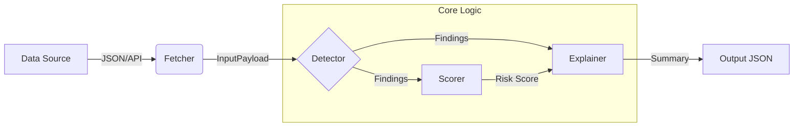

# ChainGuard AI — Fraud & Bot Detection Agent 🛡️

**ChainGuard AI** is an intelligent off-chain analysis agent designed to detect, score, and explain suspicious activity in Web3 ecosystems. It bridges the gap between raw blockchain data and human understanding by identifying patterns like bot behavior, wash trading, and repeated exploit attempts.

---

## 🧐 Problem

Web3 networks face persistent integrity issues:
*   **Automated Bot Activity**: High-frequency scripts that clog networks and gain unfair advantages.
*   **Wash Trading**: Artificial volume generation to mislead investors.
*   **Exploit Attempts**: Repeated, anomalous contract interactions.

Raw blockchain data (hashes, timestamps, gas usage) is opaque. Investigators and users struggle to answer: *"Is this wallet acting maliciously, and if so, why?"*

**ChainGuard AI** solves this by:
1.  Ingesting normalized transaction data (from files or live APIs).
2.  Applying heuristic rules to detect specific behavioral patterns.
3.  Producing a readable risk score and explanation.

---

## 🏗️ Architecture

The agent follows a modular pipeline design:



1.  **Fetcher**: Retrieves transaction history from PolygonScan (or other chains) and normalizes it.
2.  **Detector**: Runs a suite of rules (High Frequency, Wash Trading, Repeated Calls) against the transactions.
3.  **Scorer**: Aggregates finding severities into a unified risk score (0-100).
4.  **Explainer**: Generates a human-readable summary of *why* the score is high.

---

## 🛠️ Tech Stack

*   **Language**: [Python 3.10+](https://www.python.org/)
*   **Data Validation**: [Pydantic v2](https://docs.pydantic.dev/) (Strict type enforcement)
*   **Testing**: [Pytest](https://docs.pytest.org/)
*   **API Integration**: [Requests](https://pypi.org/project/requests/) (PolygonScan interaction)
*   **Configuration**: [Python-dotenv](https://pypi.org/project/python-dotenv/)

---

## 📸 Screenshots & Usage

### 1. Live Analysis (CLI)
Running the agent against a real wallet address:

```bash
python -m src.main --address 0xTargetWalletAddress --chain polygon
```

**Output:**
```json
{
  "entity_id": "0xTargetWalletAddress",
  "risk_score": 85,
  "findings": [
    {
      "rule_id": "HIGH_FREQUENCY",
      "severity": "medium",
      "description": "Unusually high transaction frequency detected (potential bot)."
    },
    {
      "rule_id": "WASH_TRADING_SUSPECT",
      "severity": "high",
      "description": "High concentration of transactions between same addresses."
    }
  ],
  "explanation": "ChainGuard AI Assessment:\nRisk Score: 85/100\n\nAnalysis detected potentially suspicious behavioral patterns:\n- Unusually high transaction frequency detected (potential bot).\n- High concentration of transactions between same addresses.\n\nSummary:\nThe observed activity triggers multiple risk indicators. Users are advised to exercise caution."
}
```

---

## 🚀 Getting Started

### Prerequisites
*   Python 3.8+
*   PolygonScan API Key (for live data)

### Installation

1.  **Clone the repository**
    ```bash
    git clone https://github.com/yourusername/chainguard-ai.git
    cd chainguard-ai
    ```

2.  **Set up environment**
    ```bash
    python -m venv venv
    source venv/bin/activate
    pip install -r requirements.txt
    ```

3.  **Configure API Key**
    ```bash
    export POLYGONSCAN_API_KEY=your_key_here
    ```

### Running Tests
```bash
pytest
```
